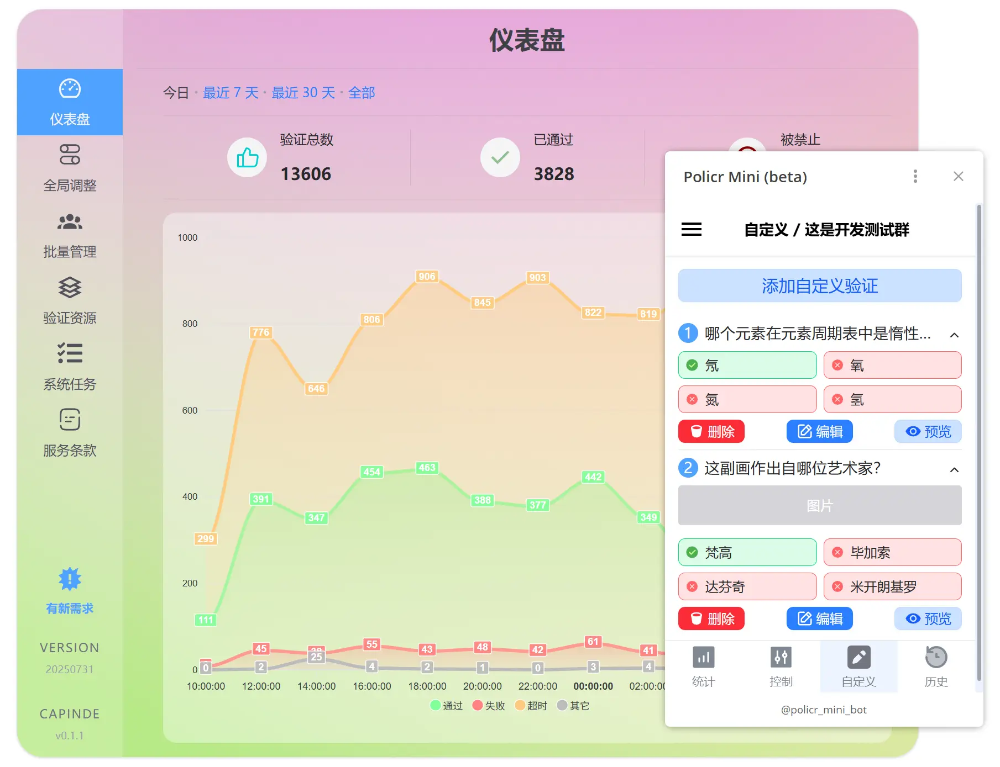

# WuFengBot

[自行部署](docs/deployment_guide.md) | [许可证](LICENSE)

WuFengBot 是一个基于 PolicrMini 二次开发的 Telegram 群组管理机器人，支持多群独立配置、入群验证、自动回复、抽奖、私聊中转和商品通知等功能。

## 介绍

本项目主要功能包括：

- 提供自定义验证（定制验证）和其它各种验证类型
- 支持公开群、私有群、管理员全匿名群
- 兼容已启用/未启用 Approve new members（审核新成员）等多种模式
- 为机器人拥有者（运营者）设计的全功能 web 后台
- 为管理员（用户）设计的 Mini Apps 控制台

_最初时本项目是作为 Policr 机器人的最小化替代品而诞生，当前已成为独立的重量级机器人。旨在为 Telegram 群组管理提供更便捷的体验。_

### 新的变化

从我们的博客文章了解最近的更新：

- [2025-07-30](https://blog.hentioe.dev/posts/policr-mini-updates-2025-07-31.html)
- [2024-04-05](https://blog.gramlabs.org/posts/policr-mini-updates-2024-04-05.html)
- [2024-01-01](https://blog.gramlabs.org/posts/policr-mini-updates-2024-01-01.html)

## 技术介绍

本项目使用 Elixir 语言开发，具备 Erlang 系统一切优点。为了在开发过程中更轻易的从根源解决问题，作者本人从零开发了 TG bot 库（[Telegex](https://github.com/telegex/telegex)），并基于该库构建了本项目。

作为 [Telegex](https://github.com/telegex/telegex) 的现实案例，从事实上证明了它可以让机器人足够可靠、稳定的运行。 并且 [Telegex](https://github.com/telegex/telegex) 相较于早已存在的多个同类库，仍然具有更正确、完整的支持，更加优雅的实现等优点。

## 关注我们

- [POLICR · 中文社区](https://t.me/policr_community)
- [POLICR · 更新通知](https://t.me/policr_changelog)

## 未来计划

本项目仍在积极维护，包括完成度和质量优化，它还需要较长的一段时间来完善自身。这期间也会继续探索新的模式和方案，不断演进。
